# Turgon - Complete System Flowchart

```mermaid
graph TD
    %% --- Definitions and Styles ---
    classDef ai fill:#e1f5fe,stroke:#01579b,stroke-width:2px,color:#01579b,rx:5,ry:5;
    classDef storage fill:#fff3e0,stroke:#e65100,stroke-width:2px,color:#e65100,rx:5,ry:5;
    classDef human fill:#e8f5e9,stroke:#1b5e20,stroke-width:2px,color:#1b5e20,rx:5,ry:5;
    classDef secure fill:#fce4ec,stroke:#880e4f,stroke-width:2px,stroke-dasharray: 5 5,color:#880e4f,rx:5,ry:5;
    classDef process fill:#f5f5f5,stroke:#616161,stroke-width:2px,color:#616161,rx:5,ry:5;
    classDef fallback fill:#fff9c4,stroke:#f57f17,stroke-width:2px,stroke-dasharray: 3 3,color:#f57f17,rx:5,ry:5;

    %% --- Start: Inputs & Setup ---
    subgraph Setup [Initial Setup & Data Ingestion]
        AMLCSV[/📊 IBM AML Dataset CSV\nKaggle Download/]
        SchemaDetect(🔍 Adaptive Schema Detection\nAuto-map column names)
        AMLCSV --> SchemaDetect
        SchemaDetect --> DBLoad[⚙️ DuckDB Loader\nNormalize to canonical schema]
        DBLoad --> IndexCreate[🚀 Performance Optimization\nCreate adaptive indexes]
        IndexCreate --> ViewCreate[📊 Compliance Views\naccount_summary, high_value_txns]
        ViewCreate --> CompanyDB[(🛢️ AML Transaction Database\nDuckDB Read-Only Mode)]
    end

    %% --- Phase 1: Policy-as-Code Conversion ---
    subgraph Phase1 [Phase 1: RuleForge - Policy Extraction]
        PolicyDocs[/📄 Upload Policy PDF\nAML/FinCEN/Basel III/]
        
        PolicyDocs --> PDFParser(📄 Docling PDF Parser\nAttempt 1: Full Pipeline)
        PDFParser -->|Success| TextExtract[📝 Structured Text\nMarkdown + Tables]
        PDFParser -->|Fail| SimplePipeline(📄 Fallback: Simple Pipeline\nNo ML models)
        SimplePipeline -->|Success| TextExtract
        SimplePipeline -->|Fail| RawExtract(📄 Fallback: pypdfium2\nRaw text extraction)
        RawExtract --> TextExtract
        
        TextExtract --> RuleArchitect(🧠 Rule Architect Agent\nGroq Llama-3.1-8b-instant)
        RuleArchitect -->|Extract Rules| RuleJSON[📋 Policy Rules JSON\nid, type, condition, threshold]
        
        RuleJSON --> Fingerprint(🔐 SHA-256 Fingerprinting\nDeduplicate rules)
        Fingerprint --> Validate(✅ Pydantic Validation\nSchema enforcement)
        Validate -->|Valid| RuleStore[(📦 Rule Store\npolicy_rules.json)]
        Validate -->|Invalid| ValidationError[⚠️ Validation Errors\nReport to user]
        ValidationError -.->|Retry| RuleArchitect
    end

    %% --- Phase 2: Secure SQL Execution ---
    subgraph Phase2 [Phase 2: SecureMonitor - SQL Generation & Execution]
        RuleStore --> PhaseMode{🎯 Execution Mode}
        PhaseMode -->|Phase 2 Only| DeterministicSQL[⚙️ Deterministic SQL Builder\nNo LLM - Direct translation]
        PhaseMode -->|Phase 123| QueryEngineer(🧠 Query Engineer Agent\nGroq Llama-3.1-8b-instant)
        
        CompanyDB -.->|Schema Injection| QueryEngineer
        CompanyDB -.->|Schema Metadata| DeterministicSQL
        
        DeterministicSQL --> SQLDraft[📝 Generated SQL Query]
        QueryEngineer --> SQLDraft
        
        SQLDraft --> BatchProcess{📦 Batch Processing\nProcess 5 rules at a time}
        
        BatchProcess --> Layer1[🛡️ Layer 1: Comment Stripping\nRemove -- and /* */ comments]
        Layer1 --> Layer2[🛡️ Layer 2: SELECT Allowlist\nMust start with SELECT]
        Layer2 --> Layer3[🛡️ Layer 3: DDL/DML Blocklist\nBlock DROP/DELETE/UPDATE/etc]
        Layer3 --> Layer4[🛡️ Layer 4: Injection Prevention\nNo semicolon multi-statements]
        
        Layer4 -->|Valid| RowCap[⚙️ Row Capping\nLIMIT 500 for safety]
        Layer4 -->|Blocked| SecurityBlock[🚫 Security Block\nLog & reject query]
        
        RowCap --> Sandbox[⚙️ DuckDB Execution Sandbox\nread_only=True mode]
        Sandbox <-->|Execute Query| CompanyDB
        Sandbox --> ViolationResults[📉 Violation Results\nrow_count + sample_violations]
        
        SecurityBlock --> ViolationReport
        ViolationResults --> ViolationReport[(📋 Violation Report\nviolation_report.json)]
        
        BatchProcess -.->|Next Batch| BatchProcess
    end

    %% --- Phase 3: Explanation & Risk Classification ---
    subgraph Phase3 [Phase 3: Explainer - Plain-English Alerts]
        ViolationReport --> ExplainMode{🤖 Explanation Mode}
        
        ExplainMode -->|--no-llm flag| DeterministicExplain[⚙️ Deterministic Explainer\nTemplate-based alerts]
        ExplainMode -->|Default LLM| ExplainAgent(🧠 Explanation Agent\nGroq Llama-3.1-8b-instant)
        
        RuleStore -.->|Rule Context| ExplainAgent
        RuleStore -.->|Rule Context| DeterministicExplain
        
        ExplainAgent -->|Generate| AlertText[📝 Plain-English Alert]
        DeterministicExplain --> AlertText
        
        AlertText --> RiskClassify[🎯 Risk Classification\nHIGH ≥500, MEDIUM ≥50, LOW ≥1]
        RiskClassify --> ActionMap[📋 Recommended Actions\nSAR filing, monitoring, review]
        
        ActionMap --> ExplanationStore[(📑 Explanations JSON\nexplanations.json)]
    end

    %% --- Phase 4: Human-in-the-Loop Dashboard ---
    subgraph Phase4 [Phase 4: HITL - Human Governance]
        ExplanationStore --> Dashboard{{👨‍💻 Streamlit Dashboard\nHuman-in-the-Loop UI}}
        
        Dashboard --> KPICards[📊 KPI Cards\nTotal rules, violations, risk breakdown]
        Dashboard --> ViolationCards[🎴 Violation Cards\nColor-coded by risk level]
        Dashboard --> SampleDisplay[🔍 Sample Violations\nFirst 5 rows per rule]
        Dashboard --> AuditViewer[📜 Audit Log Viewer\nRecent 200 events]
        
        Dashboard --> HumanReview{👤 Analyst Decision}
        
        HumanReview -->|✅ CONFIRMED| ConfirmAction[📝 Log: CONFIRMED\nAnalyst + Notes + Timestamp]
        HumanReview -->|❌ DISMISSED| DismissAction[📝 Log: DISMISSED\nFalse positive notes]
        HumanReview -->|🚨 ESCALATED| EscalateAction[📝 Log: ESCALATED\nSenior review required]
        HumanReview -->|⏸️ PENDING| PendingAction[📝 Log: PENDING\nAwaiting more info]
        
        ConfirmAction --> HITLStore[(💾 HITL Decisions\nhitl_decisions.json)]
        DismissAction --> HITLStore
        EscalateAction --> HITLStore
        PendingAction --> HITLStore
    end

    %% --- Phase 5: Audit Trail & Reporting ---
    subgraph Phase5 [Phase 5: Audit & Compliance Reporting]
        HITLStore --> AuditLog[(🔒 Immutable Audit Trail\nSQLite - Append Only)]
        
        AuditLog --> EventTypes[📋 Logged Events\nPIPELINE_RUN, HITL_*, EXPLANATION_RUN]
        
        EventTypes --> AuditStats[📊 Audit Statistics\ntotal_events, pipeline_runs, decisions]
        
        AuditStats --> ComplianceReport[📄 Compliance Report\nTimestamped violation summary]
        
        ComplianceReport --> ExportPDF[📑 Export Options\nPDF, CSV, JSON]
    end

    %% --- Feedback & Orchestration ---
    HITLStore -.->|Feedback: Improve prompts| ExplainAgent
    AuditLog -.->|Performance metrics| RuleArchitect
    
    %% --- Phase Orchestration ---
    subgraph Orchestration [CLI Orchestration]
        CLI[⚙️ main.py CLI]
        CLI --> PhaseSelect{🎯 --phase flag}
        PhaseSelect -->|1| Phase1
        PhaseSelect -->|2| Phase2
        PhaseSelect -->|3| Phase3
        PhaseSelect -->|12| Phase1
        PhaseSelect -->|23| Phase2
        PhaseSelect -->|123| Phase1
        
        Phase1 -.->|Sequential| Phase2
        Phase2 -.->|Sequential| Phase3
    end

    %% --- Applying Styles ---
    class RuleArchitect,QueryEngineer,ExplainAgent ai;
    class RuleStore,CompanyDB,AuditLog,ViolationReport,ExplanationStore,HITLStore storage;
    class Dashboard,HumanReview,KPICards,ViolationCards human;
    class Layer1,Layer2,Layer3,Layer4,Sandbox,RowCap secure;
    class PDFParser,SchemaDetect,DBLoad,Fingerprint,Validate,BatchProcess,RiskClassify process;
    class SimplePipeline,RawExtract,DeterministicSQL,DeterministicExplain fallback;
```

## Key Features Highlighted

### 🔐 Security (Red Dashed Boxes)
- 4-layer SQL validation
- Read-only database mode
- Row capping (500 max)
- Execution sandbox

### 🤖 AI Agents (Blue Boxes)
- Rule Architect (Phase 1)
- Query Engineer (Phase 2)
- Explanation Agent (Phase 3)
- All using Groq Llama-3.1-8b-instant

### 💾 Storage (Orange Boxes)
- policy_rules.json
- violation_report.json
- explanations.json
- hitl_decisions.json
- audit.db (SQLite)
- aml.db (DuckDB)

### 👤 Human Interaction (Green Boxes)
- Streamlit dashboard
- 4 decision states: CONFIRMED, DISMISSED, ESCALATED, PENDING
- KPI cards, violation cards, sample display

### ⚙️ Processes (Gray Boxes)
- Adaptive schema detection
- SHA-256 fingerprinting
- Pydantic validation
- Batch processing (5 rules)
- Risk classification

### 🔄 Fallback Pipelines (Yellow Dashed Boxes)
- PDF parsing: Full → Simple → Raw
- Explanation: LLM → Deterministic
- SQL generation: Agent → Deterministic

## Execution Modes

| Mode | Phases | Description |
|------|--------|-------------|
| `--phase 1` | RuleForge only | Extract rules from PDF |
| `--phase 2` | SecureMonitor only | Execute existing rules |
| `--phase 3` | Explainer only | Generate alerts from violations |
| `--phase 12` | RuleForge + SecureMonitor | Extract & execute |
| `--phase 23` | SecureMonitor + Explainer | Execute & explain |
| `--phase 123` | All phases | Full pipeline (default) |

## Additional Flags

- `--no-llm`: Use deterministic explanation (Phase 3)
- `--skip-phase1`: Use existing rule store
- `--pdf <path>`: Specify policy PDF path
